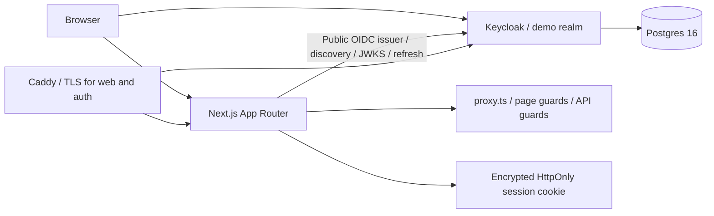
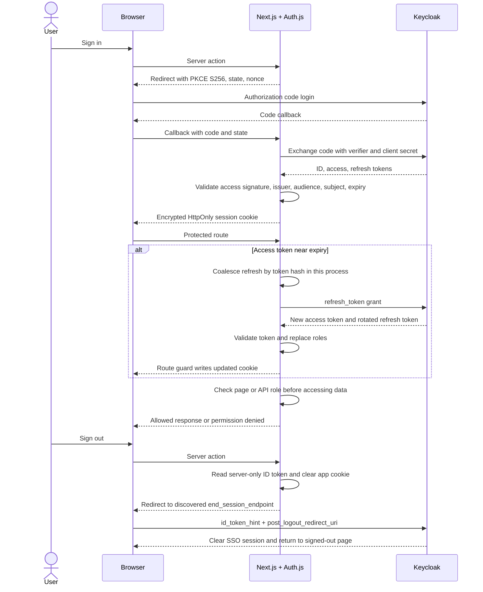

# Next.js + Keycloak: SSO and server-enforced RBAC

A portfolio example of an App Router application using a self-hosted Keycloak identity provider. Auth.js handles the OIDC authorization code flow. The app validates signed access tokens, renews them with rotating refresh tokens, enforces role access on the server, and performs RP-initiated logout. Docker Compose supplies reproducible local identity services and a separate HTTPS deployment configuration.

**Verification status:** the repository was created and reviewed without starting the application, installing `node_modules`, or running its unit tests, browser tests, or build. Dependency metadata was resolved to create the lockfile. Static findings and the remaining runtime checks are recorded in [docs/VERIFICATION.md](docs/VERIFICATION.md). This is an implemented example, not a claim of a tested production deployment.

Live demo: **not deployed**. Replace this text with your verified deployment URL before publishing a live demo link.

## Start locally

Prerequisites: Node.js 24.21.0, pnpm 12.9.1, Docker with Compose v2, and free local ports 3000 and 8080. Enable pnpm through Corepack if needed: `corepack enable`.

From the repository root, one command installs dependencies, generates private local credentials, waits for the identity services, and starts the app:

```sh
pnpm setup
```

If dependencies are already installed:

```sh
pnpm infra:up && pnpm dev
```

Open `http://localhost:3000`. Keycloak is at `http://localhost:8080`. The browser and the host Next.js process both use `http://localhost:8080/realms/demo` as the issuer. Use `localhost`, not `127.0.0.1`, in browser URLs.

There are no manual realm setup steps. On its first boot, Keycloak imports the realm, confidential `web` client, protocol mappers, roles, and users. The bootstrap script creates `infra/.env` and `apps/web/.env.local` with random secrets. It preserves existing files and refuses mismatched client secrets. Keycloak startup import skips an existing realm, so changing an env secret later does not update that client automatically.

Local Keycloak admin credentials are generated in `infra/.env`. All local exposed services bind to loopback. `pnpm infra:down` preserves the named database volume.

To rebuild the local demo realm from its committed seed, discard the local database deliberately:

```sh
docker compose --env-file infra/.env -f infra/docker-compose.yml down -v
pnpm infra:up
```

`down -v` deletes local realm changes and sessions. Do not use this command on a deployment you want to preserve.

## Demo accounts

These passwords are intentionally public, fake, and demo-only. Do not use this seed for private business data.

| User | Password | Role | Access |
| --- | --- | --- | --- |
| alice | `Alice-demo-only-123!` | admin | Dashboard, editor, admin, stats API |
| bob | `Bob-demo-only-123!` | editor | Dashboard, editor |
| carol | `Carol-demo-only-123!` | viewer | Dashboard |

| Route | Server policy |
| --- | --- |
| `/` | Public |
| `/dashboard` | Any authenticated identity |
| `/editor` | Editor or admin |
| `/admin` | Admin |
| `/api/admin/stats` | 401 without a valid session, 403 for the wrong role, 200 for admin |

The editor and admin pages contain explicit empty states. The admin counts are labelled as values from the committed demo configuration. They are not live Keycloak analytics. Protected pages have loading boundaries. Refresh failure goes to `/session-expired`; permission denial renders `/403`. The route guard rewrites denied protected page requests with HTTP 403. A direct visit to the public `/403` information page has HTTP 200.

## Architecture





## Decisions and pitfalls

- **Issuer and hostname mismatch:** use one issuer that both browser and app can reach. Docker service hostnames are upstream transport addresses only. The production app still calls the public HTTPS issuer. See [ADR 004](docs/adr/004-single-issuer.md).
- **Refresh rotation and races:** the realm has a 120-second access token lifetime, revokes refresh tokens, and allows zero reuse. The app requires a rotated token, validates the replacement access token, and updates roles from it. Parallel requests share a promise and a 15-second result window inside one process. Separate workers, restarted processes, and late stale cookies can still race and fail closed. This Compose deployment has one web process. See [ADR 005](docs/adr/005-refresh-coordination.md).
- **Middleware is not authorization:** Next.js 16 calls this boundary `proxy.ts`. It checks route prefixes and persists refreshed cookies. Each protected page also calls the shared `requireRole` helper through `requirePageRole`; the stats handler calls it through `adminStats`. UI link gating is only navigation UX. See [ADR 003](docs/adr/003-authorization-layers.md).
- **Logout needs an end-session request:** clearing an app cookie leaves Keycloak SSO active. A server action reads the encrypted session, clears the app cookie, and sends the browser to Keycloak with the ID token hint and exact return URI. If discovery is unavailable, the page reports that upstream logout is unconfirmed. See [ADR 006](docs/adr/006-logout.md).
- **Cookie size:** JWT sessions hold provider tokens and may be chunked into several cookies by Auth.js. The session API returns only name, email, roles, expiry, and the optional refresh error. Test request header size before expanding claims or moving behind a new proxy. See [SECURITY.md](docs/SECURITY.md).

## Verification commands

The commands below are provided for the reviewer. They were not executed during the code-only implementation.

```sh
pnpm install --frozen-lockfile
pnpm env:local
pnpm typecheck
pnpm lint
pnpm test
pnpm build
pnpm infra:config
pnpm infra:up
pnpm --filter @sso/web exec playwright install chromium
pnpm e2e
```

Vitest covers authorization, API status codes, session projection, refresh response validation, rotation, network failure, changed subjects, refresh coalescing, logout URLs, and realm invariants. Playwright covers all three roles, anonymous access, real API responses, session projection, refresh after 125 seconds, failed refresh, and SSO logout. Its test runner reads `.env.local` so it can verify encrypted cookie contents without exposing them to the page. Run browser tests against the local seed realm. Tests use a single browser worker and fresh browser contexts.

The GitHub Actions workflow includes separate quality and browser jobs. Browser traces, videos, screenshots, and authentication response logs are disabled to avoid capturing credentials. The workflow is included as source; no GitHub repository was created and no CI run has been observed.

## Pinned versions

Version metadata and official documentation were checked on 2026-10-06. Every direct package uses an exact version. The pnpm lockfile records transitive resolution and integrity hashes. Image tags are exact versions, not immutable digests.

| Tool | Version | Note |
| --- | --- | --- |
| Node.js | 24.21.0 | LTS; also used by Docker and CI |
| pnpm | 12.9.1 | Workspace package manager |
| Next.js / eslint-config-next | 16.3.8 | App Router, standalone output, `proxy.ts` |
| React / React DOM | 19.3.0 | Matching exact versions |
| next-auth | 5.0.0-beta.32 | Requested v5 remains a beta |
| Keycloak | 26.8.0 | Postgres-backed dev and optimized production image |
| Postgres | 16.15-bookworm | Requested major 16 |
| Caddy | 2.11.7-alpine | TLS and reverse proxy |
| TypeScript | 6.0.3 | Strict mode; within the lint parser's supported range |
| ESLint | 9.39.5 | Within the Next.js lint plugins' peer ranges |
| Tailwind CSS / PostCSS plugin | 4.3.3 | CSS-first configuration |
| Zod | 4.6.5 | Startup environment and OIDC claim validation |
| jose | 6.2.12 | JWKS and signed access-token validation |
| Vitest / Vite | 5.0.3 / 8.3.3 | Unit tests |
| Playwright | 1.63.0 | Chromium browser tests |

TypeScript 7.0.2 and ESLint 10.12.0 were current registry releases but fell outside peer ranges of the selected Next.js lint tooling. The versions above keep those peers compatible. shadcn/ui is owned component source in `components/ui`, with a `components.json` configuration and pinned Radix, CVA, clsx, and tailwind-merge dependencies. It is not an installed shadcn CLI dependency.

Primary references: [Next.js releases](https://nextjs.org/blog), [Auth.js installation](https://authjs.dev/getting-started/installation), [Auth.js refresh guidance](https://authjs.dev/guides/refresh-token-rotation), [Keycloak downloads](https://www.keycloak.org/downloads), [Keycloak environment substitution and imports](https://www.keycloak.org/server/importExport), [Keycloak proxy options](https://www.keycloak.org/server/reverseproxy), [Keycloak health checks](https://www.keycloak.org/observability/health), [Postgres 16 releases](https://www.postgresql.org/docs/16/release.html), [Caddy releases](https://github.com/caddyserver/caddy/releases), [Node.js LTS](https://nodejs.org/en/download), and package metadata from the [npm registry](https://registry.npmjs.org/next).

## Repository guide

```text
apps/web/auth.ts                   Auth.js configuration and token lifecycle
apps/web/proxy.ts                  Prefix guard and cookie persistence
apps/web/lib/rbac.ts               Shared typed role policy
apps/web/lib/token-lifecycle.ts    Refresh logic with injected dependencies
apps/web/lib/oidc.ts               Discovery and signed access-token validation
apps/web/app/actions.ts            Sign-in and RP-initiated sign-out
apps/web/tests/                    Unit and browser suites
infra/realm/realm-export.json      Reproducible demo realm seed
infra/docker-compose.yml          Local Keycloak and Postgres
infra/docker-compose.prod.yml     Separate HTTPS deployment
infra/Caddyfile                    Public and private identity listeners
docs/adr/                         Decisions and limitations
docs/DEPLOY.md                    VPS deployment and backups
docs/SECURITY.md                  Security properties and trust boundaries
docs/VERIFICATION.md              Static review and unexecuted checks
scripts/package-zip.py            Source-only portfolio archive
```

## Portfolio ZIP

Run `pnpm package:zip` to create `dist/nextjs-keycloak-sso-rbac.zip`. The archive includes source, configuration, tests, docs, and the lockfile. It excludes Git internals, node modules, local env files, build output, browser artifacts, logs, private keys, and backups. `.env.example` files and the intentionally public demo passwords are included. Review the archive contents before uploading if you add your own files later.

## Scope

Includes local infrastructure, realm reproducibility, OIDC login, refresh rotation, logout, RBAC, deployment configuration, documentation, unit tests, and browser tests. Expo/mobile, Kubernetes, clustering, custom Keycloak SPIs, LDAP, custom themes, account provisioning, publishing workflows, and live analytics are outside scope. No live deployment or passing test claim is implied.

MIT license. See [LICENSE](LICENSE).
